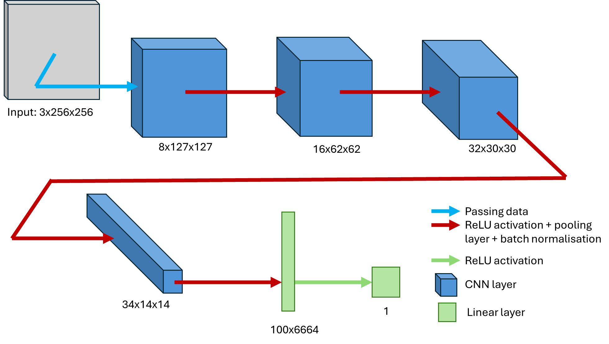
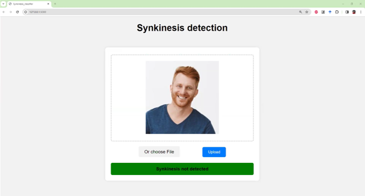

# synkinesis_classifier
## Diagnosing Facial Synkinesis Using Artificial Intelligence: A Step Forward in Facial Palsy Care?

### Overview
This repository contains the code for the paper Diagnosing Facial Synkinesis Using Artificial Intelligence: A Step Forward in Facial Palsy Care? LINK_TO_PUBLICATION_TBD. The goal of this project is to leverage a Convolutional Neural Network (CNN) to distinguish picture of patients with facial synkinesis and healthy individuals.

### Model
The core of this project is a Convolutional Neural Network (CNN) trained to analyze facial images and diagnose synkinesis. The model architecture is designed to capture intricate facial features and distinguish between healthy and affected individuals with high accuracy.

CNN Model Architecture

### Web application
An easy-to-use Flask application is provided to interface with the model. This app allows users to upload facial images and receive a diagnosis.

Flask App Screenshot

